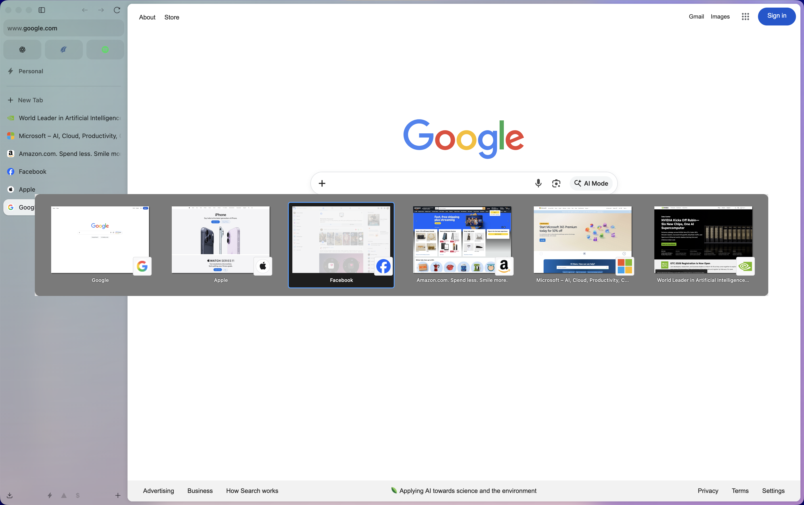

# Zen Reverse Tab Switch With Ctrl+Backtick

In [Zen Browser](https://zen-browser.app/), to move the tab switcher backwards after you've activated it with ^ + Tab, you have to use ^ + Shift + Tab, which is a pain and not very natural. ^ + \` is used by Arc to cycle backwards in its tab switcher and is much easier to type. This customization allows you to do use ^ + \` to cycle backwards in Zen.

### Requirements

- MacOS 13 or later
- [Karabiner Elements](https://karabiner-elements.pqrs.org/) (`brew install --cask karabiner-elements`)

### Installation

- Ensure that Karabiner Elements has been opened at least once (so it creates a config file) and has the necessary permissions.
- Clone this repository.
- Run `chmod +x install-zen-karabiner.sh`, then run `./install-zen-karabiner.sh`.

Now, you'll be able to use ^ + \` to cycle backwards in the Zen tab switcher. This customization works by re-mapping ^ + \` to ^ + Shift + Tab while Zen is the frontmost application, so you can still use the original ^ + Shift + Tab to cycle backwards.
